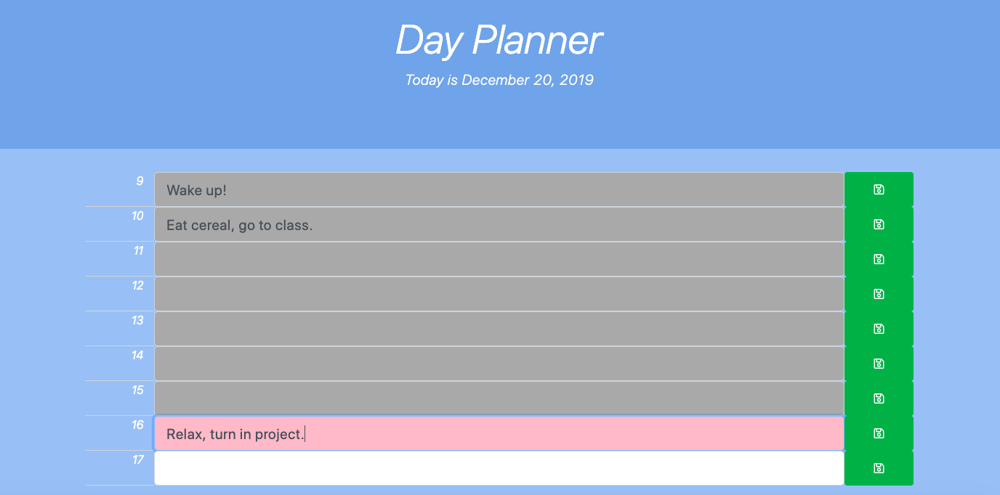

# DayPlanner

# How it works
## Adding To-Dos
* The hours are represented in military time from 9am to 5pm.
* To add a task for the time slot, type in the text box and click save.
    * When refresh is pressed, the text will persist.
    
## Dynamically Shaded Input Boxes
* The input fields for the todos are color coded based on the current time of day.
    * If the text field is gray, the time has already passed.
    * If the text field is pink, that represents the current hour.
    * If the text field is white, that hour is in the future.
* At midnight, the text fields will clear for the coming day.

